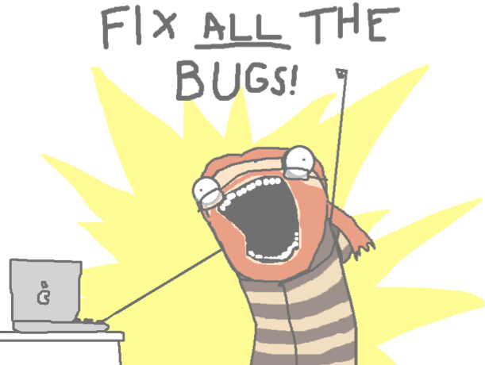
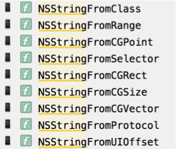
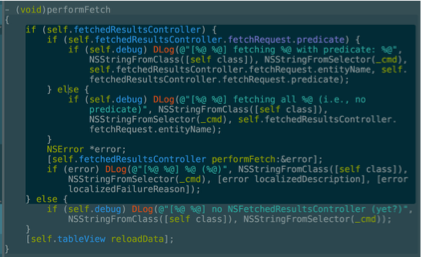
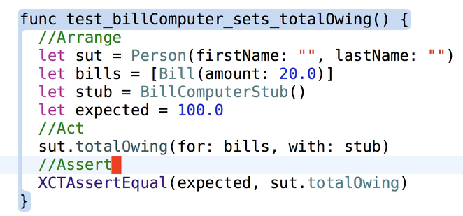
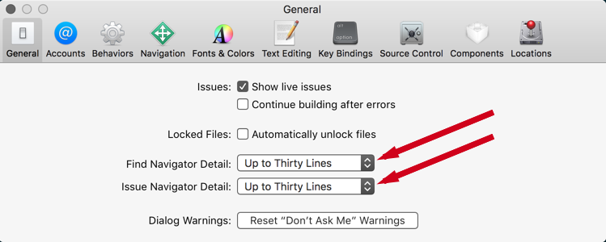

autoscale: true
build-lists: true

# [fit]iOS Debugging <br>+ Instruments

---



---

## [fit] Overview

* Alternatives to Debugging
  * Print statements
  * Asserts
* Important Xcode Settings
* Debugger Tour
* Instruments: Allocations/Time Profiler
* Debugging Advice
* Practice Debugging
* Essential Tools

---
## [fit] What I don’t cover

* This is just an intro.
* I don’t cover LLDB commands.
* The debugger has a whole CL interface that is very powerful.
* 🎗 Instead of learning LLDB commands become a unit test master!

---

## [fit] Print Tricks 🧘🏼‍♂️

---

```objc
// Objc

NSLog(@"%d: %s", __LINE__, __PRETTY_FUNCTION__);

```

---

```swift
// Swift

/*
#file
#function
#line
#column
*/

// print is a variadic function

print(#file, #function, #line, #column)

```


---

[.build-lists: false]

**Convenience methods in Objc for converting C primitives to NSString**

```objc

CGRect rect = CGRectMake(0, 0, 100, 100);
NSLog(@"%@", NSStringFromCGRect(rect));

NSLog(@"%@", @(10).stringValue);

// Swift treats CGRect as a Swift Struct! 🙃
print(rect)

```

---



[.build-lists: true]

---

[.build-lists: true]

## The Good & 💩 of Print

**Good**
- Easy, immediate, essential
  
**Bad**
-  Called “cowboy debugging” for reason
- Can introduce bugs. (You're adding testing to production code. Don't.)
- Need to be removed before shipping.
- DLog/ALog & other alternatives automatically removed from release builds.
- Swift automatically removes Assert from release builds.
- Makes code harder to read.
- "Busy console" problem. (Solution: print the line/function in the console).

```swift
// Eg.
print("======>>>>>>!!!!!! HEY !!!!!!!<<<<<<=========")

```

---

## NSAssert/Assert

* We’ve seen Asserts in the tests exercise (eg. XCTestAssertNil()), and unit testing lecture.
* Plain Asserts are functions that take 2 parameters.
  * The first parameter is some statement that is being asserted to be *true*.
  * The second, optional parameter, is a message that is logged only if the assertion fails. (This can be a format string).
* Assertions assert something to be true, and if that statement is not true the app crashes and dumps the message to the console.

---

[.autoscale: false]

```objc

// Objc
NSAssert(self.data, @"data should not be nil");

NSAssert(self.data.count == 20, 
@"%@ was expected to be equal to 20", 
@(self.data.count).stringValue);

```

```swift
// Swift
let num = 10
assert(num == 10, 
"This message will not run because num is 10")
assert(num == 11, 
"\(num) is not equal to 11")

```

---

[.autoscale: true]

## Question
- Why would you ever want to force your app to crash?

## Problem with Asserts
- They should be removed from production code (automatic in Swift).
- But you can use macros that automatically remove them from production code in Objc (eg. ZAssert).
- You’re adding code to your *app* target to do testing. Don't.
- Might as well write unit tests instead! Unit tests are asserts. But they live in a separate target from your production code. Much smarter. **UNIT TESTS == BETTER**.
- But for quick tests in an app that isn’t using unit tests, it’s a reasonable choice.

---

## [fit]Helpful Xcode <br>Pro Settings

---

## [fit] Folding Ribbon

* Ribbon folding was removed from Xcode 9.
* Xcode 9 supports a version of the Ribbon Folding by holding down ⌘ + bring the mouse pointer over the first word in a function or class.
* Great for solving scope issues.
* But it’s likely a "code smell" if you have to use the ribbon to figure out your scopes.
* Repeated conditional statements or switches ARE almost always a code smell.

---





---

## [fit] Show Full Error Messages in Sidebar

* Settings > General in Xcode, increase number of lines for errors!



---

# [fit] Debugger Demo
## [fit] Open BreakPointsTourSwift

---

## [fit] Instruments

* Xcode has a massive instruments feature used for debugging and performance tuning.
* We’ll just look very briefly at two of the most useful instruments.
  * Allocations: takes a snapshot of all of the objects your app allocates, retains and releases.
  * Time Profiler: gives you data on how long your app is spending running various methods.
  
---

# [fit] Instruments Demo<br>Open AllocationsTest & TimeProfiler

---

## [fit] Debugging Strategies

* Avoid stabbing in the dark. THINK before changing anything.
* My Technique:
  * Describe problem thoroughly. 
  * Try to describe the precise conditions that trigger **unexpected** behaviour. 
  * If you need more info, gather it. THINK, don’t just start stabbing into the dark (i.e. commenting out lines **superstitiously**).
  * Form a hypothesis. 
  * Start with most obvious and easy to test.
  
---
  
## [fit] More...
  
  * Test your hypothesis.
  * If that isn’t it, go to the next most obvious cause.
  * Repeat until you find the problem and solve it.
  * Document your results in a Solutions Log (Agile Best Practice).
  * Always take any compiler errors seriously. Decrypt them first.
  * Get in the habit of solving problems yourself before looking them up on SO.
  
---

## [fit] More...
  
  * Consider that a problem might have more than a single cause. 
  * Avoid complex problems by a practice of continuous testing. Better yet use TDD.
  * When building always try to get your code to a testable state, test and then move to building the next element.
  * Learn to write unit tests.
  
---

# [fit] Open<br>DebuggingExerciseSwift

---

# [fit] Important Tools

---

[.build-lists: false]

##  [fit] Viewing Diff Files

* [SourceTree](https://www.sourcetreeapp.com)
* [P4Merge](https://www.perforce.com/product/components/perforce-visual-merge-and-diff-tools)
* [Git Tower](https://www.git-tower.com/mac/)
* [Fork](https://git-fork.com)
* [Kaleidoscope](http://www.kaleidoscopeapp.com)

---

[.build-lists: false]

## [fit] Networking Tools

* [Paw](https://itunes.apple.com/ca/app/paw-http-rest-client/id584653203?mt=12)
* [Postman Chrome Extension](https://chrome.google.com/webstore/detail/postman/fhbjgbiflinjbdggehcddcbncdddomop?hl=en)
* [Charles Proxy](https://www.charlesproxy.com)

---

[.build-lists: false]

## [fit] References

* [Apple  Debugging](https://developer.apple.com/support/debugging/)
* [Apple Debugging With Xcode](https://developer.apple.com/library/ios/documentation/DeveloperTools/Conceptual/debugging_with_xcode/chapters/debugging_tools.html)
* [Instruments User Guide](https://developer.apple.com/library/content/documentation/DeveloperTools/Conceptual/InstrumentsUserGuide/index.html)
* [LLVM](http://lldb.llvm.org)
* [Using Breakpoints](http://jeffreysambells.com/2014/01/14/using-breakpoints-in-xcode)
